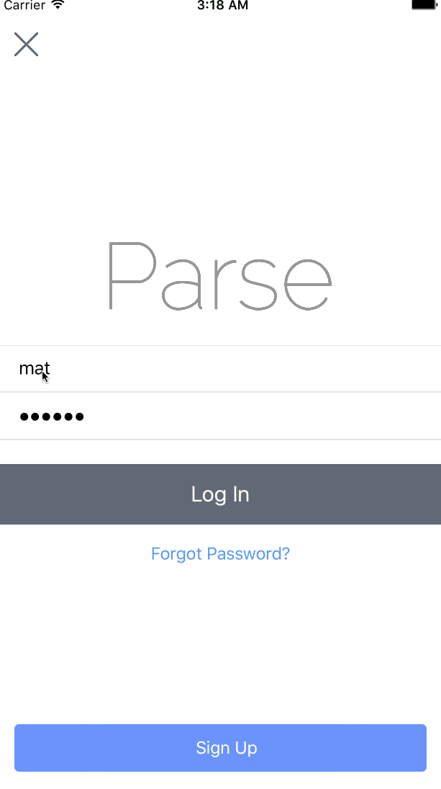

###

###What Armoire Does

Armoire aims to be a CRM for personal shoppers running their own small businesses, as well as providing a platform for their clients to track their service and communicate with them in one location using the "profile" page and related communication pages provided. 

The core feature set for the stylist's is a list of their clients, profile pages that allow quick access to the most relevant facts about their clients (measurements, price range for different types of clothing, along with basic demographic data), a communication platform that provides an easy to follow history, notes for future reference about what works and doesn't work for the client, a camera that creates photos that are associated with the appropriate client, and the ability to create appointments (including providing a history of past appointments and notifying both client and stylist about upcoming appointments).

The client will only be able to access their own profile page, the communication page (with access only to their stylists), and the appointment tool. 

The above is the bare minimum that needs to be provided to ensure value is added through the Armoire application; further enhancements such as reminder notifications related to clients that are primed for further engagement, a billing feature, and a shipping feature would further establish the Armoire app as a valuable tool in this space.

###Features

####Required (MVP)

- Business
  - [ ] SquareSpace.com/logo or some other icon
  - [ ] Choose tagline
  - [ ] Choose font
- (Personal Shopper's View) Client Management
  - Sign Up Page
    - [ ] Designer or Client can sign up
    - [ ] If the client was invited they will have a text sent with code and url to download
      OR
    - [ ] the link to download auto-sets the email field
  - Clients Page
    - [ ] list of clients which show their names
    - [ ] click cell leads to individual profile page
  - Client Profile Page
    - [ ] include pic, phone, email, and other basic data (next time seen, money spent, began working with, etc)
    - [ ] include measurements that can be modified by user (name, measurement, price range)
    - [ ] can access and edit personal notes 
  - Scheduler
    - [ ] should see upcoming appointments and past appointment with time, location, and customer
    - [ ] should be added to their phone calendar
    - [ ] remind of upcoming appointments
  - Messaging
    - [ ] message capacity in realtime between client and designer
    - [ ] history of messaging history
  - Add Client
    - [ ] Add a client which sends email to client with link to download the Armoire App
    - [ ] First check if client already exists, in which case notify them and allow process to associate them with the designer attempting to claim them
    - [ ] If no client exists, create client and text them with a code that will confirm their identity and association to designer
  - Photo
    - [ ] Take Photo and associate it with a client
    - [ ] Icon on photo to indicate stylist took it

- (Client's View) Fashion Notes/History - Kind of like a medical record for clothes, but with ability to interact with personal shopper.
  - [ ] same as above except limited to their specific profile page with specific components (like amount spent and personal stylist notes not available, though they should be able to create their own notes)
  - [ ] Schedule Now button for top left for client view
  - [ ] Navbar has photo on left

###Stretch Goals

- Notes 
  - [ ] can be associated with specific meeting, for both customer and client 
  - [ ] Notes shareable
- Billing
  - [ ] start a timer with an associated hourly rate -> calculate final fee
  - [ ] send a request for payment to client
  - [ ] see history of payments and outstanding requests
- Reminders
  - [ ] reminder system that has toggles for common concern
  - [ ] haven't spoken to them in a while, but they logged in recently so reach out
  - [ ] bill overdue
  - [ ] sales
- Shipping
  - [ ] ships to clients seamlessly
    - [ ] print label option
    OR
    - [ ] integrate with ship or something similar

###Layout Contemplations 

Layout: Facebook group for contextual layout
Move photo to far left when moving to client navbar
Modal for detail view, block status bar, smaller icons
Contrast between global and client navbar?

### Design Variant One

(Personal Shopper's View) Clients Page

(Personal Shopper's and Client's View) Client Profile Page

(Personal Shopper's and Client's View) Messaging and Note Example Pages

(Personal Shopper's View) Calendar Example Page

###Design Variant Two

(Personal Shopper's View) Clients Page

(Personal Shopper's and Client's View) Client Profile Page - This is similar to the instagram middle tab bar UI.

### Modifications Post Ben Conversations

- First workflow
- Add in the back button area, the word "Client" to return to index
- Notifications should appear with custom notification that is clickable, leading to modal for quick response, when modal is closed the view from before the notification appeared still exists (classic modal)
- Conceptualize Client and Stylist views separately; ensure all shared content is module

### Required Xibs

- sign up page
- log in page
- add client page
- custom menu
- nav bar
- patient index page
- messaging page
- the note page
- the calendar page
- patient show page
- setting page
- camera page

### Required Research and Chosen Tools

Layout: Facebook group for contextual layout

- DB 
  - [x] Chosen Tool: Parse (open to discussion)
  - [] Spike:
    - [ ] authentication tokens
- Messaging
  - [x] Chosen Tool: Layer
  - [] Spike:
    - [ ] authentication tokens
- Camera
  - [ ] Chosen Tool:
  - [ ] Spike: 
- Calendar (check out square appointments)
  - [ ] Chosen Tool: 
  - [ ] Spike:
- Notifications (check out CWStatusBarNotifications, Reminders API)
  - [ ] Chosen Tool: 
  - [ ] Spike:

### Database

##User Object
- types: Stylist and Client
  - Stylists has many clients
  - Client have many stylists (we only code for supporting ONE at this point)
  - relation between users?
- picture references
- note objects
- message objects
- calendar reservations 

##Pictures ( references inside user, no owner)

##Notes ( owner of the object )

##Messages ( owner of the object, stylist but client id visible)

##Calendar Reservatons ( owner of the object, stylist but client id visible)

### Workflow(Tuesday Midnight; this functionality should be operable)

- Matt: DB and Messaging
- Randy: Camera and Calendar
- Morgan: Notifications and Container View Controller

### Milestone One (Wednesday; submitted Tuesday midnight)

- Separate your features into required, optional and bonus.
  - Morgan
- Break down work for each team member to complete for this week into issues on Github assigned to a milestone.
  - Morgan
- Setup and configure Parse (or similar) server-side data store
  - Randy
- Design your database schema and generated model objects with initial fields
  - Matt
- Create view controllers needed for early functionality.
  - Morgan
